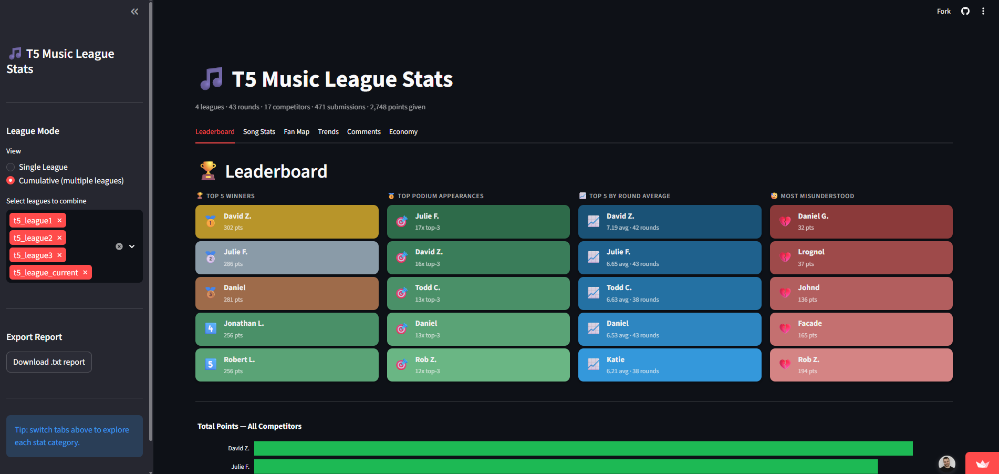
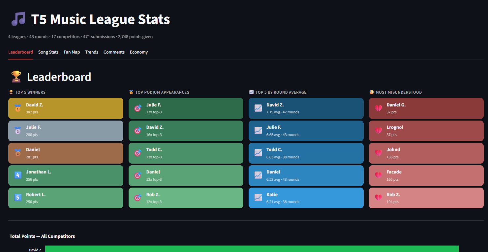
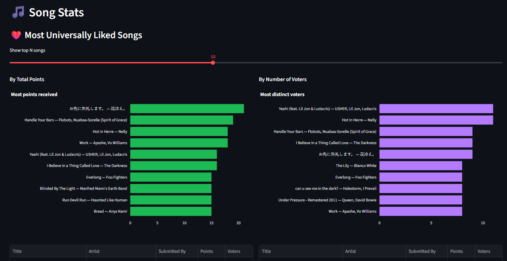
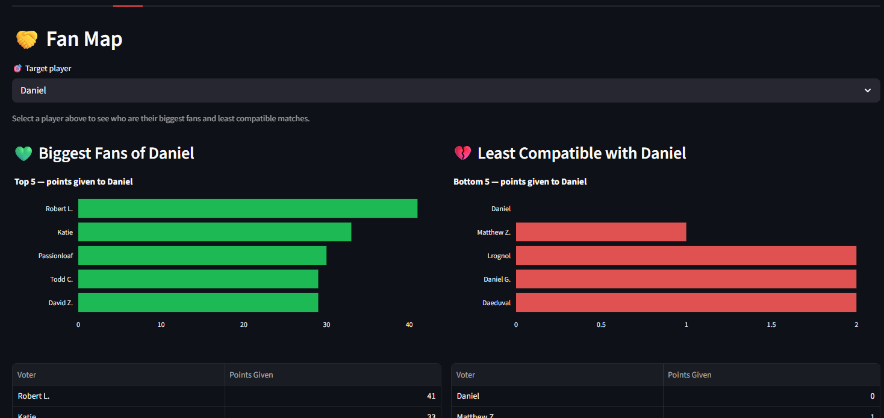
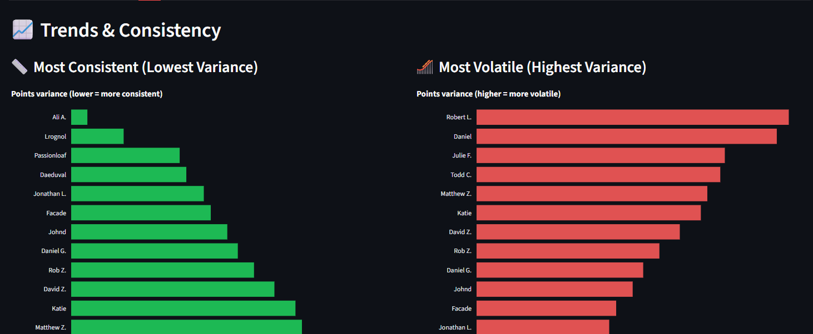
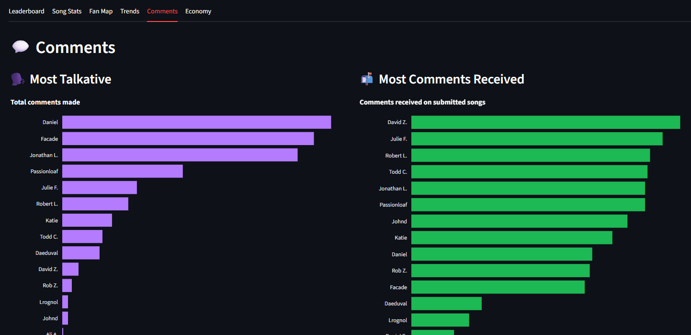
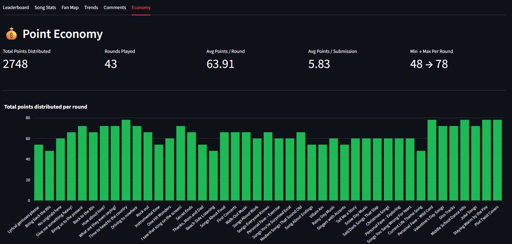

# 🎵 Music League Stats

A Streamlit web app that turns exported [Music League](https://musicleague.com/) data into rich interactive stats, charts, and downloadable reports.


---

## Table of Contents

1. [Features](#features)
2. [Project Structure](#project-structure)
3. [Setup & Running Locally](#setup--running-locally)
4. [Adding or Updating League Data](#adding-or-updating-league-data)
5. [CSV Format Reference](#csv-format-reference)
6. [App Tabs Overview](#app-tabs-overview)
7. [How to Expand the App](#how-to-expand-the-app)
8. [Deploying to Streamlit Community Cloud](#deploying-to-streamlit-community-cloud)

---

## Features

- **Multi-league support** — load one league or combine multiple leagues into a cumulative view
- **6 interactive tabs** — leaderboard, song stats, fan map, trends, comments, point economy
- **Sidebar controls** — switch between single/cumulative mode, choose a target player for fan analysis
- **Downloadable report** — export a full plain-text `.txt` stats report from the sidebar
- **Privacy-friendly display names** — full names are shortened to "First L." format automatically
- **Dark-themed UI** — Spotify-green accent, responsive Plotly charts

---

## Project Structure

```
music_league/
│
├── app.py                      # Streamlit app entry point (thin orchestrator)
├── music_league_stats.py       # All stat functions + data loading + report generator
│
├── ui/                         # Modular tab renderers
│   ├── __init__.py
│   ├── components.py           # Shared UI primitives (CSS, bar_chart, stat_tile)
│   ├── tab_leaderboard.py      # 🏆 Leaderboard tab
│   ├── tab_blowouts.py         # 🎵 Song Stats tab (liked songs, blowouts, repeated songs, artists)
│   ├── tab_fan_map.py          # 🤝 Fan Map tab
│   ├── tab_trends.py           # 📈 Trends & Consistency tab
│   ├── tab_comments.py         # 💬 Comments tab
│   └── tab_economy.py          # 💰 Point Economy tab
│
├── data/                       # All league season data lives here
│   ├── season_1/               # One subfolder per league season
│   │   ├── competitors.csv
│   │   ├── rounds.csv
│   │   ├── submissions.csv
│   │   └── votes.csv
│   └── season_2/
│       ├── competitors.csv
│       ├── rounds.csv
│       ├── submissions.csv
│       └── votes.csv
│
├── requirements.txt            # Python dependencies
└── README.md
```

> **League data folders** are auto-discovered from the `data/` directory. Any subfolder inside `data/` that contains all four required CSV files will automatically appear in the sidebar as a selectable league.

---

## Setup & Running Locally

### Prerequisites

- Python 3.10+
- A virtual environment **outside** the repo folder (recommended — see note below)

### Install dependencies

```powershell
# Create a virtual environment (Windows) — place it outside the repo
python -m venv "C:\path\to\your\environments\.venv"

# Activate it
"C:\path\to\your\environments\.venv\Scripts\Activate.ps1"

# Install packages
pip install -r requirements.txt
```

> **Note on venv location:** Virtual environment `.exe` launcher scripts hardcode the Python path at creation time. If you move the `.venv` folder after creating it, the launchers will break. Always recreate the venv with `python -m venv` at the desired final location.

### Run the app

```powershell
& "C:\path\to\your\environments\.venv\Scripts\streamlit.exe" run app.py
```

The app will open at `http://localhost:8501`.

> **Windows note:** If you see emoji rendering issues in the terminal, prefix the command with `$env:PYTHONUTF8=1 ;` before running.

### `requirements.txt`

```
pandas
streamlit
plotly
```

---

## Adding or Updating League Data

### Adding a new league season

1. Export your league data from [musicleague.com](https://musicleague.com/) (Settings → Export Data).
2. Create a new subfolder inside `data/`, e.g. `data/season_3/`.
3. Place the four exported CSV files inside it:
   ```
   data/
   └── season_3/
       ├── competitors.csv
       ├── rounds.csv
       ├── submissions.csv
       └── votes.csv
   ```
4. Restart (or hot-reload) the app — the new league will appear automatically in the sidebar.

### Cumulative view (multiple leagues)

In the sidebar, switch the radio button from **Single League** to **Cumulative**, then check all the leagues you want to combine. Stats like "Most Improved" automatically scope the first/last 5 rounds *per league* before averaging, so results remain meaningful across seasons.

### Renaming a league

The display name shown in the sidebar is the folder name. Simply rename the folder inside `data/` (e.g. `data/season_1` → `data/Season 1 — The OG Crew`) and restart the app.

---

## CSV Format Reference

These match the export format from Music League. **Do not rename columns.**

### `competitors.csv`

| Column | Description |
|--------|-------------|
| `ID` | Unique player UUID |
| `Name` | Display name |

### `rounds.csv`

| Column | Description |
|--------|-------------|
| `ID` | Unique round UUID |
| `Created` | ISO 8601 timestamp |
| `Name` | Round title |
| `Description` | Round prompt |
| `Playlist URL` | Spotify playlist link |

### `submissions.csv`

| Column | Description |
|--------|-------------|
| `Spotify URI` | Track identifier (e.g. `spotify:track:...`) |
| `Title` | Song title |
| `Album` | Album name |
| `Artist(s)` | Artist name(s), comma-separated for collaborations |
| `Submitter ID` | UUID matching `competitors.csv` |
| `Created` | ISO 8601 timestamp |
| `Comment` | Optional submitter note |
| `Round ID` | UUID matching `rounds.csv` |
| `Visible To Voters` | `Yes` / `No` |

### `votes.csv`

| Column | Description |
|--------|-------------|
| `Spotify URI` | Track identifier matching `submissions.csv` |
| `Voter ID` | UUID matching `competitors.csv` |
| `Created` | ISO 8601 timestamp |
| `Points Assigned` | Integer point value given |
| `Comment` | Optional vote comment |
| `Round ID` | UUID matching `rounds.csv` |

---

## App Tabs Overview

### 🏆 Leaderboard
- **Top 5 Winners** — players ranked by total points received across all rounds
- **Top Podium Appearances** — players who most often finished in the top 3 in a single round
- **Most Misunderstood** — players from the most recent league who received the fewest total points
- **Top 5 by Round Average** — players with the highest average points per round (blue tiles)
- **Total Points bar chart** — all competitors ranked visually
- **Points Per Round Heatmap** — per-player, per-round points grid
- **Zero Points Incidents** — how many times each player scored zero in a round
- **Average Points Per Round** — each player's mean score per round, ranked



### 🎵 Song Stats
- **Most Universally Liked** — top songs by total points and by distinct voter count, each with submitter shown; adjustable top-N slider (3–20)
- **Biggest Blowouts** — rounds with the largest winning margin (1st vs. 2nd place), bar chart + table
- **Most Submitted Songs** — songs that were submitted more than once across all rounds
- **Most Artist Appearances** — artists whose songs appear most frequently across all submissions



### 🤝 Fan Map
- **Biggest Fans** — who gave the most points to the selected target player
- **Least Compatible** — who gave the fewest points to the target player
- **Most Generous Voter** — who spread their points across the most distinct submitters per round
- **Full Points-Given Matrix** — heatmap of every voter → submitter point total



### 📈 Trends & Consistency
- **Most Consistent** — players with the lowest variance in points received per round
- **Most Volatile** — players with the highest variance
- **Most Improved** — comparison of early-round vs. late-round averages per league
- **Points Over Time** — line chart of each player's points across all rounds



### 💬 Comments
- **Most Talkative** — players ranked by total comments made (votes + submissions)
- **Most Commented-On Songs** — songs that received the most vote comments
- **Full Comment Table** — searchable table of every comment from votes and submissions



### 💰 Point Economy
- **Summary metrics** — total points distributed, rounds played, averages per round and per submission
- **Points Per Round bar** — total points given out each round over time
- **Vote Distribution** — how often each point value (1, 2, 3, …) was used



---

## Display Name Formatting

Player names are automatically shortened to a **"First L."** format for cleaner chart labels:

| Raw name in CSV | Displayed as |
|-----------------|--------------|
| `Julie F*******` | `Julie F.` |
| `jonathan.l****` | `Jonathan L.` |
| `rob z*****` | `Rob Z.` |
| `passionloaf` | `Passionloaf` |

Names with a single word (usernames, aliases) are capitalised and left as-is. Names separated by either a space or a dot are both handled.

---

## How to Expand the App

### Adding a new stat function

1. Open `music_league_stats.py`.
2. Add your function. It should accept `LeagueData` fields as arguments (e.g. `submissions`, `votes`, `competitors`) and return a list of dicts or a scalar.
3. Add the result to `generate_report_text()` if you want it included in the `.txt` download.

### Adding a new tab

1. Create `ui/tab_mynewtab.py` with a `render(data: LeagueData) -> None` function.
2. Import it in `app.py`:
   ```python
   from ui import tab_mynewtab
   ```
3. Add a new tab to the `st.tabs(...)` list in `app.py` and call `tab_mynewtab.render(data)` inside its `with` block.

### Changing the color scheme

Edit `ui/components.py`:

```python
ACCENT = "#1DB954"   # change to any hex color
```

`CHART_BASE` controls the dark chart background. Update `plot_bgcolor` / `paper_bgcolor` there to change the chart canvas color.

---

## Deploying to Streamlit Community Cloud

1. Push the project to a **public** (or private, with access granted) GitHub repository.
2. Include a `requirements.txt` in the repo root:
   ```
   pandas
   streamlit
   plotly
   ```
3. Also include your league data folder(s) in the repo, or use [Streamlit secrets](https://docs.streamlit.io/deploy/streamlit-community-cloud/deploy-your-app/secrets-management) to load data from a remote source.
4. Go to [share.streamlit.io](https://share.streamlit.io), click **New app**, point it at your repo and `app.py`.
5. Click **Deploy** — done.

> **Note on data privacy:** If your league data contains real names, be mindful of hosting it in a public repo. The app automatically shortens names to "First L." format in the UI, but the raw CSVs still contain full names. Consider anonymizing the CSVs or using a private repository with restricted access.
